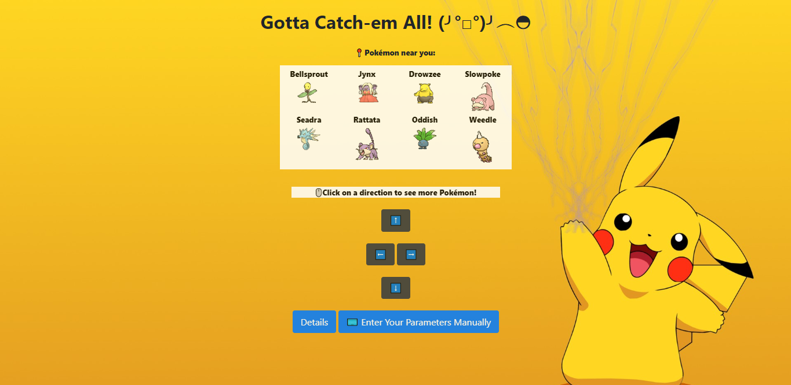

# pokemon_go app

A Pokémon predicting web-app bot based on one's IP location (latitude/longitude), weather, city, closeness to water and other geo-location features.

My first hackathon at [General Assembly](https://generalassemb.ly/education/data-science/toronto)!

### The Ask :white_check_mark:

My bot will be judged on "creativity", "usability" and "interactivity" of my flask app. My bot must:

- Use some type of machine learning algorithm
- Flask front-end that accepts user input
- Augment the data with at least one other data source (think web scraping, google maps api, images?)

## Brownie Points 🍰
- Flask/html/css that's prettier than just a couple of white input boxes
- Deploy the model to heroku (or similar)

Aren't you curious about all the cute Pokémon near you? 😻
Heroku: http://poke-bowl.herokuapp.com/

